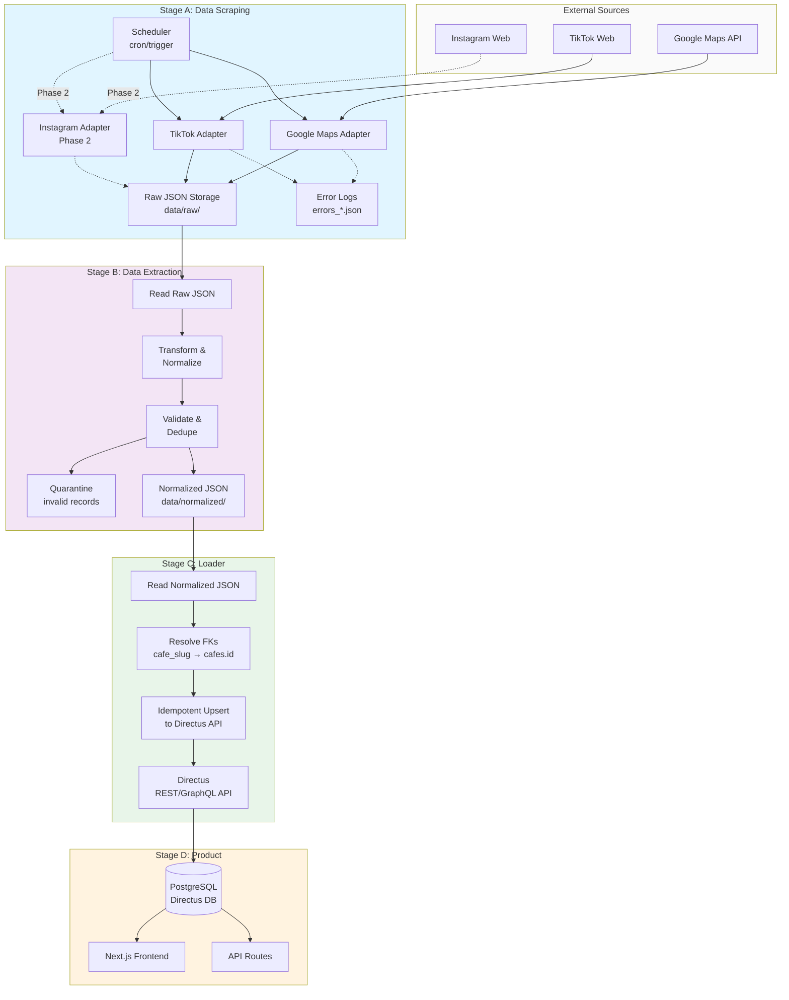

# Data Pipeline Oveview

Type: Documentation

# Goal

Build a reliable data pipeline for the Samarinda Coffeeshop Discovery site with a Minimum Viable Product approach.

Core pipeline outcome:

1. Scraping writes source-native raw JSON.
2. Extraction writes normalized JSON contracts.
3. Loader writes normalized data into schema tables.
4. Frontend/API reads published rows from Directus/PostgreSQL.

Related docs:

[data-scraping](https://www.notion.so/data-scraping-337f290164fb803fa8e8de2d01977e07?pvs=21)

[data-extraction](https://www.notion.so/data-extraction-337f290164fb800cba23e0ad1dcd5386?pvs=21)

[Tech Spec — Data Scraping](https://www.notion.so/Tech-Spec-Data-Scraping-337f290164fb815a8867c07fc855c701?pvs=21) 

## Bigger Picture

- Phase 1: build a reliable raw-to-structured data foundation.
- Phase 2: expand sources and improve data quality operations.
- Phase 3: add semantic AI enrichment and ranking signals.
- Phase 4: enable richer product intelligence (summaries, recommendations, discovery features).

## Schema Target Surface

Current schema-aligned targets:

- `cafes`
- `cafe_photos`
- `cafe_tags`
- `influencer_reviews`
- `events` (v2-ready, not required for Phase 1 ingestion)

Operational run telemetry can remain an external contract (`scrape_runs.json`) if not modeled in Directus.

## Stage Model

```
Scheduler (Linux cron on VPS)
  -> Stage A: Data Scraping (raw JSON)
  -> Stage B: Data Extraction (normalized JSON)
  -> Stage C: JSON Loader (normalized JSON -> PostgreSQL)
  -> Stage D: Frontend/API reads PostgreSQL
```

Boundary rules:

- Stage A and Stage B do not write to PostgreSQL.
- Stage C is the only stage that writes database rows.
- Each stage consumes only the previous stage outputs.

## Workflow Architecture

### End-to-End Pipeline Flow



## Scheduling (UTC+8)

Phase 1 default schedule:

- `02:15` daily: Google Maps full baseline crawl.
- `08:10`, `14:10`, `20:10`: Google Maps incremental crawl.
- `03:30`, `15:30`: TikTok crawl.
- Instagram excluded from Phase 1 schedule.

Operational defaults:

- Add jitter `+-10 minutes`.
- Browser concurrency `2-3` workers on 8GB VPS.

## Pipeline Contracts

- Scraping never writes directly to PostgreSQL.
- Extraction consumes only raw JSON and outputs only normalized JSON.
- JSON loader consumes only normalized JSON.
- Every run writes metrics to `scrape_runs`.

## Source Priority

Phase 1 practical order:

1. Google Maps (baseline first)
2. TikTok (equal priority after baseline is stable)
3. Instagram (later phase)

## Roadmap by Phase

### Phase 1 (Current Focus)

- Google Maps baseline scraping first.
- After baseline is stable, TikTok moves to equal working priority.
- Raw JSON output contracts are stable and reproducible.
- Extraction contracts are stable and load-ready.
- JSON-to-PostgreSQL migration flow is documented and repeatable.

### Phase 2

- Instagram integration.
- Better matching between social mentions and cafes.
- Better run observability and quality monitoring.
- Product workflow decisions from team alignment (if needed).

### Phase 3

- AI enrichment fields such as `vibe_tags` and `customer_orientation`.
- Theme extraction and lightweight sentiment signals.
- Ranking signals for discovery pages.

### Phase 4

- Cafe summaries from reviews and social signals.
- Recommendation and similarity features.
- Advanced filters driven by structured + enriched attributes.

## Milestones

### M1: Foundation (Week 1)

- [ ]  Google Maps adapter operational
- [ ]  Raw JSON contracts validated
- [ ]  Extraction pipeline produces `cafes.json`, `cafe_photos.json`, `cafe_tags.json`
- [ ]  Loader writes to Directus `cafes` table
- [ ]  Quarantine flow tested with sample invalid data

### M2: Social Integration (Week 1-2)

- [ ]  TikTok adapter operational
- [ ]  Extraction produces `influencer_reviews.json`
- [ ]  Loader writes to Directus `influencer_reviews` with `is_approved = false`
- [ ]  Manual approval workflow tested in Directus admin
- [ ]  End-to-end TikTok flow validated

### M3: Production Readiness (Week 2)

- [ ]  Scheduler configured (APScheduler or cron)
- [ ]  Rate limiting and retry logic implemented
- [ ]  Error monitoring and alerting configured
- [ ]  Full pipeline tested with 10+ cafes
- [ ]  Documentation complete for handoff

### M4: Scale & Observability (Post-Launch)

- [ ]  Instagram adapter (Phase 2)
- [ ]  Run quality dashboards
- [ ]  Cross-source cafe matching improvements
- [ ]  Performance optimization based on production data

## Working Timeline (Phase 1)

Timeline for current data/AI scope: `1-2 weeks`.

### Week 1

- Lock Phase 1 scope.
- Finalize Google Maps raw and normalized contracts.
- Finalize cron schedule and stage boundaries.
- Define JSON loader contract and run metrics contract.

### Week 2

- Add TikTok as equal working priority after Google Maps baseline.
- Tighten validation, dedupe, and quarantine rules.
- Finalize migration checklist from normalized JSON to PostgreSQL.
- Finalize open team questions and unresolved product assumptions.

If compressed to 1 week, prioritize Google Maps end-to-end first and keep TikTok narrow.

## Open Questions for Team

Product and workflow decisions (not locked for Phase 1):

- Should social mentions be auto-shown or manually curated?
- Should Google Maps reviews be shown directly, summarized, or used as internal signals only?
- Are events part of launch data scope?

Scope and operations decisions:

- Final launch cafe list and coverage target.
- Freshness target (`<=6h`, `<=12h`, `<=24h`).
- Who owns quarantine review and failed-run triage.
- Proxy budget and acceptable blocking risk.
